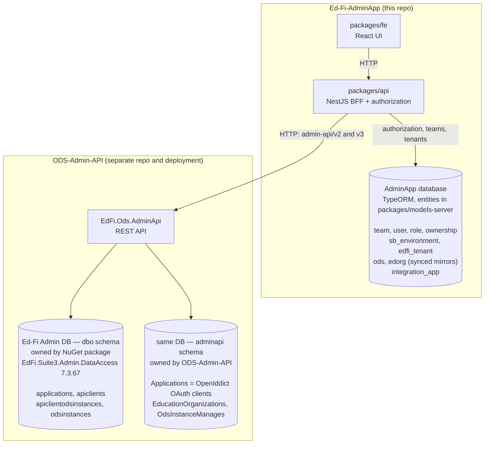
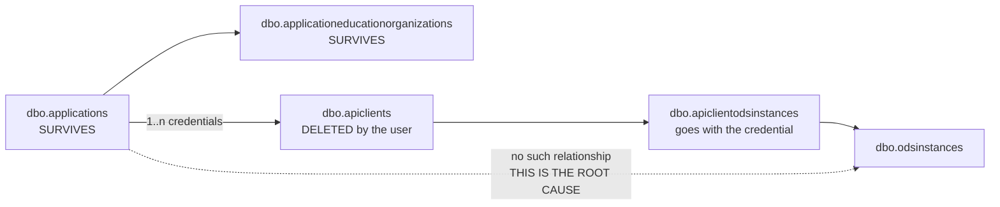
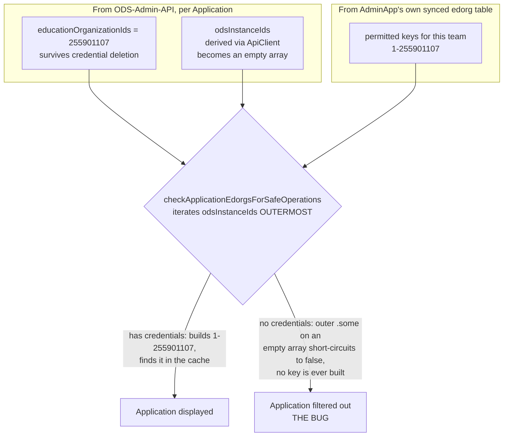

# AC-616: Applications disappear after removing all their credentials

| | |
|---|---|
| **Jira** | [AC-616](https://edfi.atlassian.net/browse/AC-616) — Bug, Medium, In Progress |
| **Parent epic** | [AC-460](https://edfi.atlassian.net/browse/AC-460) — RTB (Run the Business) |
| **Reported by** | Jesus Pardo, 2026-08-28 |
| **Affects** | Admin API **v2 and v3** (v1 is immune — see [Why v1 is immune](#why-v1-is-immune)) |
| **Repos** | `Ed-Fi-AdminApp` (root cause), `ODS-Admin-API` (two related bugs) |
| **Follow-up tickets** | [ADMINAPI-1514](https://edfi.atlassian.net/browse/ADMINAPI-1514) (the edit-500 + `Enabled`), [ADMINAPI-1515](https://edfi.atlassian.net/browse/ADMINAPI-1515) (the root-cause fix) |
| **Decision** | Prevent the state instead of handling it — block deleting an Application's last credential. See [What we are doing](#what-we-are-doing) |

---

## Summary

Deleting every credential (ApiClient) from an Application makes the Application
vanish from the AdminApp UI on refresh. The database row is **never deleted** —
AdminApi returns it correctly, and AdminApp filters it out afterwards.

An Application has **no ODS/data-store association of its own**. Its
`odsInstanceIds` is derived entirely from its credentials, so deleting the last
credential destroys information that logically belongs to the Application. Four
separate places then misbehave on the resulting empty collection.

We are **not** fixing the data model in this ticket. The parent epic (RTB)
covers technical-debt management and minor enhancements but excludes major
overhauls, so AC-616 blocks the action that creates the broken state, and the
real fixes are recorded here for later.

> ### Acceptance criteria need updating before QA retests
>
> AC-616's stated Expected Result is *"After to remove the manage credential the
> application should be continue displayed."* Our approach makes that scenario
> **unreachable** rather than making it work. It satisfies the intent — no
> vanishing Applications — but not the literal criterion. QA following the
> ticket's five steps will find Delete disabled at step 5.
>
> **Update the ticket description to describe the guard as the expected
> behaviour**, or this will be reopened as "not fixed".

---

## How to reproduce

From the ticket:

1. Create an environment (v2 or v3)
2. Enter the environment
3. Go to Applications and create one Application
4. Open **Manage credentials**
5. Remove the credentials, then go back to the Applications page

**Actual:** the Application is no longer displayed.
**Expected (per ticket):** it should still be displayed.

### Verified request sequence

```
1) POST   .../admin-api/v2/applications/     -> 201  {"id":4, ...}
2) GET    .../admin-api/v2/applications/4    -> 200  odsInstanceIds: [1]      <- ODS present
3) GET    .../admin-api/v2/apiClients/?applicationId=4  -> 200  [ {id:4, ...} ]
4) DELETE .../admin-api/v2/apiClients/4      -> 200
5) GET    .../admin-api/v2/apiClients/?applicationId=4  -> 200  []            <- expected
6) GET    .../admin-api/v2/applications      -> 200  []                       <- BUG
```

The row survives untouched — `SELECT * FROM dbo.applications` still returns
application 4 with its vendor, claimset and operational context intact.

### Two predictions worth confirming

Neither has been run. Both follow from
[the four failure sites](#the-four-failure-sites) and show the state is more
broken than the ticket describes:

- `GET .../admin-api/v2/applications/4` should now return **404** (step 2
  returned 200 before the delete) — the same guard protects GET-by-id but
  throws instead of filtering.
- `PUT .../admin-api/v2/applications/4` should return **HTTP 500** —
  see [the Application edit 500](#prerequisite-the-application-edit-500).

---

## Root cause

### Two systems, two databases

This bug is only understandable if you keep the two databases apart. AdminApp is
a BFF: it has **its own** database, and it calls AdminApi over HTTP for Ed-Fi
data. Crucially, **authorization is computed locally from AdminApp's database**,
while the Application's ODS list comes from AdminApi's.



Two consequences that matter later:

- The `dbo` schema is **not ours** — it ships in a NuGet package, which is why
  the cleanest fix (a real `dbo.ApplicationOdsInstances` table) is unavailable.
- AdminApp's `ods` and `edorg` tables are **synced copies** of the Ed-Fi side.
  The authorization cache is built from those, so an authorization decision joins
  data from *both* databases — and that join is where this bug lives.

### Why the ODS association disappears

There is no `ApplicationOdsInstance` entity anywhere in `ODS-Admin-API`. The
only path from an Application to an ODS instance runs through its credentials:



Delete every ApiClient and the whole right-hand branch goes with it, so
`GetOdsInstanceIdsByApplicationIdQuery.cs:29` — which queries
`ApiClientOdsInstances` filtered by `ApiClient.Application.ApplicationId` —
necessarily returns `[]`. The Application row and its education organizations
are untouched.

The mismatch: `POST /applications` **accepts** `odsInstanceIds` as an
Application-level input, and `PUT /applications/:id` edits it — but
`AddApplicationCommand.cs:97-105` persists it against the **ApiClient**. So the
association is conceptually an attribute of the Application and physically an
attribute of its credential.

**This is original design, not a regression.** `ApiClientOdsInstances` traces to
`020db6e2` [ADMINAPI-1332] (Admin API 2.X into 1.X); v3 inherited it wholesale
in `a2b9b568` [ADMINAPI-1404] and renamed the field to `dataStoreIds` in
`3f995b67` [ADMINAPI-1373]. There is nothing to revert — the defect has been
latent since Admin API 2.x and only became reachable once the UI allowed
deleting credentials independently.

### The four failure sites

All four are the same empty-collection blind spot. Three fail closed; one throws.

| # | Location | Repo | Symptom |
|---|---|---|---|
| 1 | `admin-api.v2.controller.ts:114` + `v3:114` — `checkApplicationEdorgsForSafeOperations` | AdminApp | Omitted from list (line 279); **404** on detail (line 307) |
| 2 | `useApplicationActions.tsx:44,77` — `canEdit` / `canDelete` | AdminApp | Edit and Delete buttons never render |
| 3 | `EditApplicationCommand.cs:50` — `ApiClients.Single()` | ODS-Admin-API | **HTTP 500** on `PUT /applications/:id` |
| 4 | `ApplicationMapper.cs:42` — `ApiClients.All(...)` | ODS-Admin-API | `enabled: true` with zero credentials |

**Site 1** — the reported bug, and the clearest illustration of the two-database
join. The check builds a composite key
`"{odsInstanceId}-{educationOrganizationId}"` (e.g. `"1-255901107"`) and looks it
up in the permission cache. One half of that key comes from each database, and
only one half evaporates:



Because the ODS instance is the *outer* loop, an empty `odsInstanceIds` means no
key is ever constructed and no lookup ever happens — so "no ODS instances"
collapses into "not authorized" rather than "no ODS refinement". The edorg half
of the key, which is what actually carries authorization meaning, was available
the whole time.

**Site 2** — the same shape in the frontend. `dataStoreIds.flatMap(...)` yields
an empty array, and `Authorize.tsx` treats an empty config as unauthorized.
Consequence: fixing site 1 alone would produce a visible Application whose
buttons still never appear.

**Site 4** — the mirror image: `.All()` on an empty collection is vacuously
`true`, so a credential-less Application reports itself as enabled.

The authorization cache (`auth/authorization/helpers.ts:386-401`) is keyed per
edorg. The orphaned Application still carries
`educationOrganizationIds: [255901107]`, so **only the ODS half of the key is
missing** — which is what makes option A possible.

### Not AdminApi's read path

Worth stating, since the ticket suspected a SQL join. AdminApi's list query is
correct: `GetAllApplicationsQuery.cs:49-52` uses `.Include(...)`, which EF Core
emits as LEFT JOINs, with no `.Where` on ApiClients. `ReadApplication.cs:41-43`
maps every entity it receives and defaults a missing ODS list to an empty list.
AdminApi returns the Application; AdminApp discards it.

### Why v1 is immune

`admin-api.v1.controller.ts:115` loops over edorgs only and discards the ODS
(`edorgCompositeKey` returns just the edorg id), so there is no outer array to be
empty. This is **not** precedent for option A, though: v1 has no
InstanceManagement/Sync concept and creates Applications with no ODS instance at
all, so its edorg-only key reflects the absence of the concept rather than a
judgement that the ODS is redundant.

---

## What we are doing

**Block deleting an Application's last credential.** An Application with no
credentials cannot do anything useful, so preventing the state is better product
behaviour than displaying it gracefully — and it makes all four failure sites
unreachable through the UI.

### The guard

Keep the Delete control **visible but disabled** when the Application has exactly
one credential, with a tooltip explaining why. A control that silently vanishes
is harder to understand than one that explains itself.

| Layer | Enforce | Why |
|---|---|---|
| **Frontend** — `useApiClientActions.tsx` | Yes | What the user actually sees |
| **BFF** — `admin-api.v{2,3}.controller.ts`, `DELETE apiClients/:id` | Yes — `409 Conflict` | A UI-only guard is bypassed by any direct API call, and this is a data-integrity rule |
| **AdminApi** — `DeleteApiClientCommand` | Not now | The durable place for the rule, but it changes behaviour for every Admin API client. Revisit with the deferred work |

**Residual risk:** the BFF guard closes the *serialized* stale-tab case — a
second DELETE re-reads the count and sees 1, so it is rejected. It does **not**
close two DELETEs issued **simultaneously** against an Application's last two
credentials: both requests can read a count of 2 before either delete commits,
so both proceed and the Application is left with zero credentials. There is no
compare-and-set available at the AdminApi boundary, so this is not fixable at
this layer — it is a known gap, not an oversight.

### The wording

Legend, shown as a warning **only when the Application is down to exactly one
credential**, on both the credentials list page and the credential detail page:

> **An Application needs at least one credential to work.** To replace a
> credential, create the new one first, then delete the old one.

Tooltip on the disabled delete action, when the count is known to be exactly
one:

> This is the Application's only credential and can't be deleted. Create another
> credential first.

The Delete action also blocks while the credential count is unknown (the query
is pending, or it failed), and says so rather than falling back to the generic
label — a disabled control with no stated reason reads as broken:

> Checking credential count…

> Couldn't check the credential count — try refreshing the page.

Whatever reason is shown is also carried into the control's **accessible name**.
`title` alone is not enough: the icon-button variant sets `aria-label` from the
action's `text`, and `aria-label` outranks `title` in accessible-name
computation, so a reason living only in `title` is announced to nobody.

Both avoid the term "ApiClient" — the UI says *credentials* everywhere else — and
the second sentence gives the user the way forward rather than only stating the
restriction.

The legend is deliberately conditional rather than a standing notice: it appears
at the moment the restriction actually bites, which is also the moment the
"create the new one first" instruction becomes actionable. At zero credentials it
does not render — that copy has nothing to replace, and the state should be
unreachable anyway. Note the display rule (`=== 1`) is intentionally narrower
than the enforcement rule (`<= 1` in both the frontend guard and the BFF); they
answer different questions.

Manual verification on 2026-09-06 confirmed the `title` tooltip renders on
disabled controls in Chrome, Brave and Edge, so the tooltip carries the
point-of-action explanation and the legend is the standing one.

---

## Prerequisite: the Application edit 500

**Decision taken: AC-616 shipped first; this is tracked separately as
[ADMINAPI-1514](https://edfi.atlassian.net/browse/ADMINAPI-1514).**

The original recommendation here was that the two ship together. The team
overrode it, reasoning that AC-569 had already made the two-credential state
reachable — so AC-616 increases traffic through a pre-existing defect rather
than creating one, while removing an unrecoverable data state in exchange. The
risk is recorded on PR #351 and in ADMINAPI-1514.

**All three Admin API projects carry this line**, so no version is exempt:
`EdFi.Ods.AdminApi/…/EditApplicationCommand.cs:50` (v2),
`EdFi.Ods.AdminApi.V3/…/EditApplicationCommand.cs:50`, and
`EdFi.Ods.AdminApi.V1/…/EditApplicationCommand.cs:43`. The V3 copy is
structurally identical to v2's.

**To reproduce, edit the Application itself** — `PUT /applications/{id}` — not
its credentials. Listing an Application's credentials
(`GET /apiClients/?applicationId={id}`) returns 200 with both rows and never
touches this command, so it is not a valid check.

`EditApplicationCommand.cs:50` is unguarded — verified that nothing between the
Application lookup (line 35) and line 50 checks the count:

```csharp
var apiClient = application.ApiClients.Single();
```

`Enumerable.Single()` throws on an empty sequence **and on two or more
elements**. So:

1. An already-orphaned Application returns **500** on `PUT /applications/:id` —
   it cannot be edited at all (failure site 3).
2. **An Application with two or more credentials also returns 500.** AC-569
   shipped full credential management, so a user can now add a second
   credential — after which editing the Application fails.

The collision: **the legend we are adding tells users to create the new
credential before deleting the old one, routing them straight through the
two-credential state.** The guidance we give to avoid one bug walks users into
another that is already live. `.Single()` is therefore a precondition for
AC-616's own guidance, not a follow-up — and it is independently more urgent,
since it needs no deletion to trigger.

Fix: handle 0 and 2+ explicitly. If the edit only makes sense for a single
credential, return a 4xx with a clear message instead of throwing.

---

## Deferred options

Two viable fixes remain for the underlying flaw. Recorded at the level of
approach and gotchas rather than code — whoever implements this should re-derive
the code from the repos, but the findings below are expensive to rediscover.

### Option A — AdminApp: edorg-outer authorization key

Make the **edorg** the outer loop and treat the ODS as an optional refinement:
when the Application has no ODS instances, match on the edorg alone (the
authorization cache keys are `"{ods}-{edorg}"`, so this is a suffix match).
Apply the mirror fix to failure site 2 so the FE builds a non-empty authorize
config.

- **Effort:** small. Two controller methods plus one FE hook.
- **Confirmed safe:** edorgs belong to exactly one ODS and are never shared
  between them, so the edorg uniquely determines the ODS. The fallback is
  therefore *equivalent* to the composite key, not a weakening of it. (This was
  the one open risk; the team has confirmed it.)
- **Recovers already-orphaned Applications** — the one thing option C2 cannot do.
- **Leaves the root cause in place**, and does not fix failure site 3.

### Option C2 — ODS-Admin-API: give the Application its own ODS association

Add an `adminapi`-schema table holding the Application-to-ODS association, write
it from the Add/Edit Application commands, and read it in
`GetOdsInstanceIdsByApplicationIdQuery` with a fallback to the existing
ApiClient-derived query. **Requires no AdminApp change at all** — `odsInstanceIds`
simply stops emptying.

- **Effort:** medium/large, with two genuine unknowns (below).
- **Fixes the root cause**, and one read-path change fixes four API consumers:
  `ReadApplication` (both overloads), `ReadApplicationsByOdsInstance`,
  `ReadApplicationsByVendor`. The reverse lookup in
  `GetApplicationsByOdsInstanceIdQuery.cs:29-31` must not be missed.
- **Does not recover already-orphaned Applications** (out of scope by decision).

**Findings that will otherwise cost hours:**

| Finding | Why it matters |
|---|---|
| `adminapi.Applications` **already exists** — it is the OpenIddict OAuth *client* table (`ClientId`, `ClientSecret`, `RedirectUris`), mapped in C# as `ApiApplication` | Do **not** name the new table `ApplicationOdsInstances`; it would read as "OAuth client ↔ ODS". Use something explicit like `EdfiApplicationOdsInstances` |
| `AdminApiDbContext` and `UsersContext` are **separate DbContexts over the same `AdminConnectionString`** (`TenantSpecificDbContextProvider.cs:47,70`) | Two `SaveChanges()` calls, so Application creation stops being atomic — a failure between them recreates the very state we are eliminating. Also `ApplicationId` is DB-generated, so the `adminapi` insert must follow the `dbo` save. **Spike a shared transaction before estimating** |
| Migration SQL is applied by the **DB-Admin Docker image**, which `wget`s the *published* `EdFi.Suite3.ODS.AdminApi` package from the Ed-Fi feed | A new `00008-*.sql` in the working tree **will not reach a local database** by rebuilding. Apply by hand, override the image, or publish a prerelease. Also confirm how existing deployments get it |
| The Admin migration set is **duplicated 4×**: `EdFi.Ods.AdminApi` and `EdFi.Ods.AdminApi.V3`, each × MsSql/PgSql. `00007` is already used twice in one folder | Four identical files to add; confirm the runner's ordering before assuming `00008` is safe |
| No `adminapi` table has an FK into `dbo` — the closest analogue, `adminapi.OdsInstanceManages`, holds a bare indexed `OdsInstanceId` | Following precedent means no FK, so cleanup on Application/ODS-instance delete becomes application-code responsibility |

### Rejected

| Option | Why |
|---|---|
| **B** — authorize any orphan with tenant-level access | Converts a visibility bug into an authorization leak across edorgs, when `educationOrganizationIds` is right there on the DTO |
| **C1** — upstream `dbo.ApplicationOdsInstances` | The canonical fix, but `EdFi.Suite3.Admin.DataAccess` (v7.3.67) owns the `dbo` schema and we cannot modify it |
| **D** — derive the ODS set from the Application's edorgs via `adminapi.EducationOrganizations.InstanceId` | Looks free, but that table is a cache populated only by a manually-triggered refresh job (`POST /odsInstances/edOrgs/refresh`). Authorization would silently depend on whether the job had run — the same bug class through a different door |

---

## Next steps

| # | Work | Repo | Ticket |
|---|---|---|---|
| 1 | Guard the last-credential delete: FE disabled action + tooltip, BFF `409`, legend below the table | Ed-Fi-AdminApp | **AC-616** |
| 2 | Update AC-616's Expected Result to describe the guard, so QA doesn't reopen it | — | **AC-616** |
| 3 | Fix `EditApplicationCommand.ApiClients.Single()` for 0 and 2+ credentials | ODS-Admin-API | **[ADMINAPI-1514](https://edfi.atlassian.net/browse/ADMINAPI-1514)** — High, ship with AC-616 ([why](#prerequisite-the-application-edit-500)) |
| 4 | Fix `ApplicationMapper.Enabled` vacuous `true` (failure site 4) | ODS-Admin-API | bundled into [ADMINAPI-1514](https://edfi.atlassian.net/browse/ADMINAPI-1514) as its secondary defect |
| 5 | Give Applications their own ODS association (option C2) | ODS-Admin-API | **[ADMINAPI-1515](https://edfi.atlassian.net/browse/ADMINAPI-1515)** — backlog; not yet estimable, two spikes named in the ticket |
| 6 | Confirm the two predictions in [How to reproduce](#how-to-reproduce) | — | part of #1 |

Already-orphaned Applications are **out of scope** by decision: their ODS
association is unrecoverable and repairing them is a new feature. This means any
Application already in that state stays invisible after the guard ships.

---

## Open questions

1. **Datastore divergence (open).** A user can edit an ApiClient's datastore
   *and* an Application's datastore independently, so the two can already
   disagree. Under option C2 that becomes a stored fact rather than a derived
   one, and the product must define which wins for authorization and display.
   Suggested default: the **Application's** set is authoritative; a credential's
   set is that credential's own detail. Must be decided before C2 is built.
2. Should creating a credential be restricted to the Application's datastore
   set? Related to (1).
3. Should the guard eventually move into AdminApi's `DeleteApiClientCommand` so
   the rule holds for every Admin API client, not just AdminApp?
4. Should `PUT`/`DELETE applications/:id` in v2/v3 be brought under the same
   authorization guard as v1, which does check them, or is their unguarded state
   deliberate?
