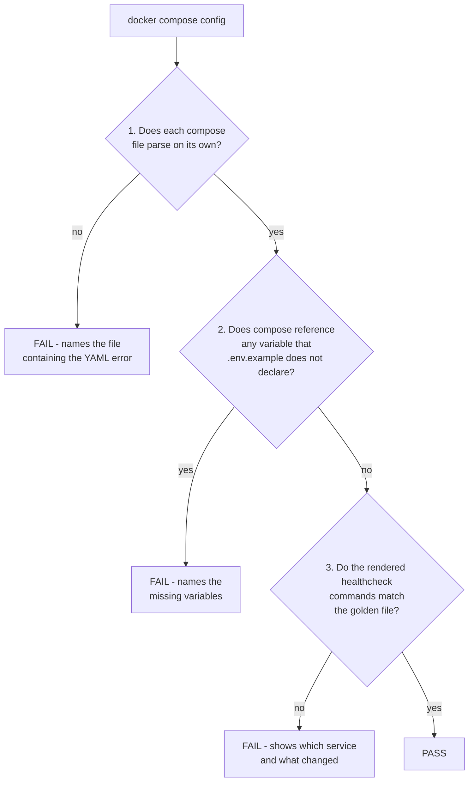
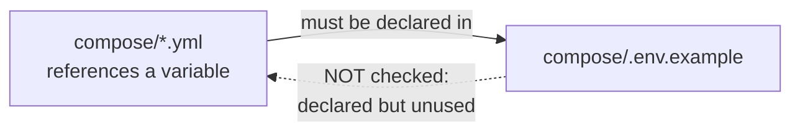
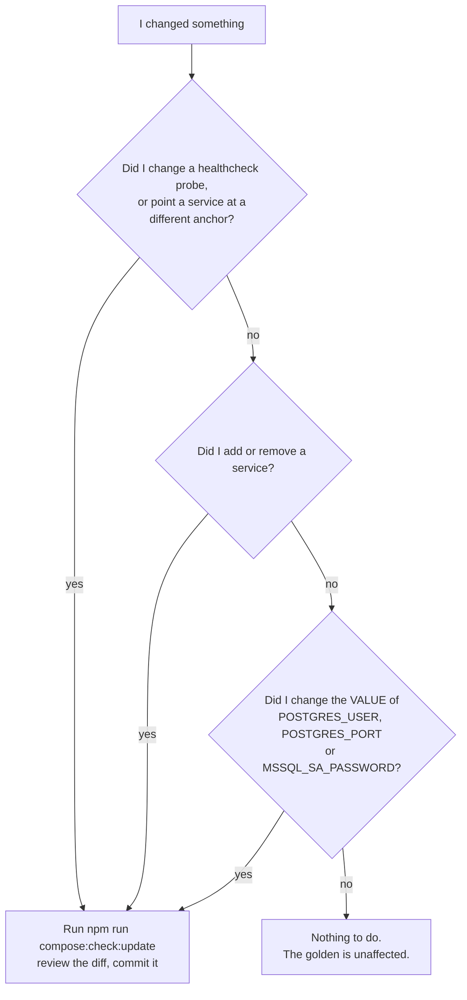

# Compose Configuration Validation

`eng/testing/check-compose-config.ps1` is a static check over the Docker Compose stack. It renders
the stack from `compose/.env.example` and asserts it is still coherent. It starts nothing and needs
no Docker daemon — `docker compose config` only parses and interpolates. It takes ~15 s locally on
Windows; the time is almost entirely Docker CLI startup across its seven `docker compose` calls, so
it is faster on the Linux CI runner.

CI runs the same script in the **Compose Config Validation** job of
`.github/workflows/on-pullrequest.yml`, so local and CI behaviour cannot drift.

## What each mechanism buys

This branch introduced several mechanisms at once. What each one is actually for:

| Mechanism                                                           | What it buys you                                                                                                                                                                                                                                                   | What it costs                                                                                                                                   |
| ------------------------------------------------------------------- | ------------------------------------------------------------------------------------------------------------------------------------------------------------------------------------------------------------------------------------------------------------------ | ----------------------------------------------------------------------------------------------------------------------------------------------- |
| **YAML anchors** — `x-healthcheck-*` in `compose/edfi-services.yml` | 25 repeated healthcheck blocks collapse into 4 definitions; the file drops from 849 to 792 lines. Retiming every probe becomes a one-line edit.                                                                                                                    | A YAML feature this repo did not use before. It also makes a wrong probe invisible in review, which is why the golden file exists.              |
| **Golden file** — `compose/compose-healthchecks.golden`             | The only thing that catches a service pointed at the wrong anchor. Nothing else does: it renders as valid YAML, and no `depends_on` in `edfi-services.yml` uses `condition: service_healthy`, so a broken probe leaves a container unhealthy while CI stays green. | Must be re-recorded when a probe, the set of services, or one of three variables changes — roughly one commit in four that touches these files. |
| **Undeclared-variable check** — assertion 2                         | Catches a variable deleted from `compose/.env.example` while a compose file still requires it, which is precisely the regression an `.env.example` cleanup risks.                                                                                                  | None. Zero maintenance — it has never needed regenerating. Covers 30 of 87 referenced variables; the rest carry `:-` defaults.                  |
| **Per-file parse** — assertion 1                                    | A YAML error names the file it is in, rather than a line number in a ~1,300-line merged document.                                                                                                                                                                  | None.                                                                                                                                           |
| **Shared script + npm scripts**                                     | CI and local runs execute identical code, so they cannot drift. Replaces what would otherwise have been a fifth hardcoded copy of the compose file list.                                                                                                           | None.                                                                                                                                           |

The two checks fail in opposite directions, which is why both are worth having: assertion 2 is
**under-inclusive** — it sees only what Compose complains about, so it misses defaults and dead
variables — while the golden is **over-inclusive**, catching every byte of a rendered command
including changes you did not think of as probe changes.

## Commands

```bash
# Run the check. This is what CI runs.
npm run compose:check

# Re-record the golden file from the current compose files.
# Only after a deliberate healthcheck change - see "When to regenerate" below.
npm run compose:check:update
```

Both are thin wrappers around `pwsh ./eng/testing/check-compose-config.ps1`, which you can also call
directly (add `-UpdateGolden` for the second form).

## What it does

Three assertions, in order. The first failure of assertion 1 stops the run, because nothing later is
meaningful if a file does not parse.



Assertion 1 runs each compose file separately so a YAML error is attributed to the file it is
actually in, rather than to a line number in the merged document.

Assertion 2 and 3 run against all compose files merged, with every profile enabled.

## Assertion 2: the dependency direction

This is the part most easily misread, so state it precisely:

> It checks that **every variable the compose files reference is declared in `compose/.env.example`**.

It does **not** check the reverse. The direction matters because it tells you which file to fix:



So when this assertion fails, **the omission is in `compose/.env.example`** — you add the variable
there. You do not add anything to the YAML.

The check works by reading Compose's own warnings, which is what gives it the limits below.

## What it does NOT catch

| Gap                                                           | Why                                               | Consequence                                                                                                   |
| ------------------------------------------------------------- | ------------------------------------------------- | ------------------------------------------------------------------------------------------------------------- |
| A deleted variable whose reference has a `:-` default         | Compose falls back silently and emits no warning  | The stack changes and the check stays green. 57 of the 87 referenced variables (66%) carry a default.         |
| A variable declared with an empty value                       | It _is_ set, so Compose has nothing to warn about | `POSTGRES_USER=` renders `pg_isready -U`, which is broken                                                     |
| A variable declared in `.env.example` that nothing references | The check only sees what Compose asks for         | Dead variables can re-accumulate — exactly what [AC-520](https://edfi.atlassian.net/browse/AC-520) cleaned up |

These are known and deliberate. Detecting the third reliably needs judgement across five consumption
surfaces (Compose interpolation, `sed`/`envsubst` templates, PowerShell regex patching in
`run-e2e-ui.ps1`, and runtime `process.env`), which a `git grep` cannot replicate without false
positives that would block unrelated PRs. See the
[AC-520 audit](../../docs/design/2026-09-10-ac-520-env-example-audit.md) for the full reasoning.

**A green check means "nothing detectably broken", not "the stack is correct."**

## Assertion 3: the golden file

`compose/compose-healthchecks.golden` records the healthcheck command of every service, one line
per service:

```
odsV7-adminV2-single-db-ods | ["CMD-SHELL","pg_isready -U postgres -h localhost -p 5432"]
nginx | <none>
```

It covers **all 34 services across all three compose files**, not only the ones using anchors —
9 of the 34 come from `adminapp-services.yml` and `nginx-compose.yml`.

### Why it exists

`compose/edfi-services.yml` defines its healthchecks through YAML anchors. Before that, a wrong probe
was visible in review because the command text itself changed. Now it is a single token:

```yaml
healthcheck: *healthcheck-api # correct
healthcheck: *healthcheck-db-socket # wrong - renders as valid YAML, reviews as fine
```

A service pointed at the wrong anchor produces a perfectly valid configuration, so Compose has
nothing to complain about. Nothing catches it at runtime either: no `depends_on` in
`edfi-services.yml` uses `condition: service_healthy`, and `run-e2e-ui.ps1` polls HTTP endpoints
rather than container health — so a broken probe leaves a container permanently `unhealthy` while
the E2E suite passes green.

The golden file is the only thing that catches this.

### It is a recording, not a specification

The golden does not know what is _correct_; it only knows what was _approved_. Regenerating it
blesses whatever the compose files currently say. That is why:

- the failure message tells you to **review the diff**, not just to regenerate, and
- `-UpdateGolden` **refuses to write** if assertion 1 or 2 is failing, since a render with an
  undeclared variable cannot be trusted as a source of truth.

## When to regenerate

The golden records exactly one thing: **each service's healthcheck command, after every variable has
been substituted.** Regenerate when that line would come out different — nothing else about the
compose files matters.

It is **not** "when an anchor changes" and **not** "when a variable changes". Two worked examples:

- Changing `PAGING_LIMIT` in `compose/.env.example` — a variable — does **not** affect the golden.
- Changing `edfiadminapp-api`'s healthcheck in `compose/adminapp-services.yml` — which uses no
  anchor at all — **does**.

Each golden line is assembled from four pieces spread across two files:

```
odsV7-adminV2-single-db-ods | ["CMD-SHELL","pg_isready -U postgres -h localhost -p 5432"]
└─ service name               └─ the probe      └─ POSTGRES_USER   └─ POSTGRES_PORT
   edfi-services.yml             edfi-services.yml  .env.example       .env.example
```

Change any one of those four and the line changes. That is the whole rule, and it is why exactly
three variables appear in the decision tree below: `POSTGRES_USER`, `POSTGRES_PORT` and
`MSSQL_SA_PASSWORD` are the only variables of the 76 declared in `compose/.env.example` that are
interpolated into a healthcheck command. Every other variable is invisible to the golden.

If you are unsure, just run `npm run compose:check` — it tells you.



In practice this means regeneration is rare — reviewing the last twelve months of history, about one
commit in four that touched these files would have needed it.

## Adding a new variable

The short version: add it, run `npm run compose:check`, and let the failure tell you what is missing.
The full picture, since a variable can reach further than Compose:

| What you are doing                                | What to update                                                                                                                                                     |
| ------------------------------------------------- | ------------------------------------------------------------------------------------------------------------------------------------------------------------------ |
| New variable referenced as `${VAR}` (no default)  | `compose/.env.example` — **required**, the check fails otherwise                                                                                                   |
| New variable referenced as `${VAR:-default}`      | `compose/.env.example` as a commented entry, per that file's own convention. The check will **not** catch omitting it                                              |
| The variable appears inside a healthcheck command | Regenerate the golden                                                                                                                                              |
| New service that has a healthcheck                | Regenerate the golden                                                                                                                                              |
| New API runtime setting read through `config`     | `packages/api/config/custom-environment-variables.js`, or the environment variable is silently ignored, plus `packages/api/config/default.js`                      |
| New `VITE_*` frontend setting                     | The `edfiadminapp-fe` `environment:` block in `compose/adminapp-services.yml`, `packages/fe/typings/env.d.ts`, and `packages/fe/entrypoint.sh`                     |
| A variable the SQL Server E2E leg must patch      | `Set-AdminAppEnvFile` in `eng/testing/run-e2e-ui.ps1` — add a `$fired` entry **and** the matching `switch -Regex` case, so the new rewrite is checked exactly once |

## Troubleshooting

**`Undeclared variable(s) referenced by compose but missing from compose/.env.example`**
Declare the named variable in `compose/.env.example`. If it is genuinely optional, give its
reference a `:-` default in the compose file instead — but note that puts it in the blind spot above.

**`Healthcheck commands changed`**
Read the diff in the message: `=>` is what the compose files render now, `<=` is what the golden
expects. If the change was intended, run `npm run compose:check:update` and commit the result. If it
was not, a service is pointed at the wrong anchor.

**`Refusing to update the golden file while the checks above are failing`**
Assertion 1 or 2 is failing. Fix that first — regenerating from an untrustworthy render would record
the breakage as the new baseline.

**`Self-test failed ... expected a 'MSSQL_SA_PASSWORD variable is not set' warning and saw none`**
`MSSQL_SA_PASSWORD` is undeclared by design, so that warning must always appear. Its absence means
Compose reworded the warning and the detector in assertion 2 has silently stopped working. Update the
pattern in `check-compose-config.ps1`.

## References

- [`compose/readme.md`](../../compose/readme.md) — the stack itself, and the healthcheck anchors
- [AC-520 audit](../../docs/design/2026-09-10-ac-520-env-example-audit.md) — why `.env.example` looks
  the way it does, and the deferred findings
- [`eng/testing/README.md`](./README.md) — the other two test runners
